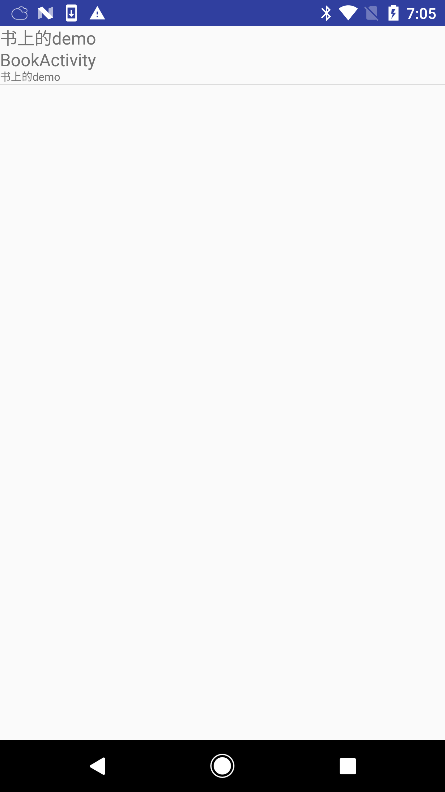

加上就能用了思密达
compile 'com.seekting:demolib:1.0.1'


具体用法:
manifest不要定义入口，因为lib里已经有入口.可能为每个demo加上描述和标题，每个demo是以activity为单位

```java
public class BookActivity extends Activity {
    static {
        MainActivity.putTitle(BookActivity.class,"书上的demo");
        MainActivity.putDesc(BookActivity.class,"书上的demo");
    }
    //代码...

```


同样你也可以这样写，它会把标题和描述展示在demo列表里
```java
@Demo(title = "测试title", desc = "测试desc")
public class TestActivity extends Activity {

```
以下是截图
